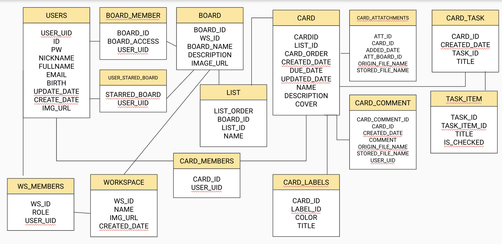

# TrelloWeb

>> URL : 

## 시연영상

### Home & Login 기능

### Main Board 기능

### Board Detail 기능

### Profile 기능

<h2> KoreaIT Academy</h2>
<h3> 과정평가형 정보처리산업기사 과정</h3>

### SSD 팀
    - (팀장) 조성연
    - 임강욱
    - 최낙연

### 개요
    - 프로젝트 지속 기간 : 2023.12 - 2024.2 (2개월)
    - 개발 언어: Java
    - 개발 환경 : IntelliJ

### 담당 역할
| 조성연                                                                                                                                                                                                                                           | 임강욱                                                                                                                                                                                    | 최낙연                                                                                                                                                                             |
|-----------------------------------------------------------------------------------------------------------------------------------------------------------------------------------------------------------------------------------------------|----------------------------------------------------------------------------------------------------------------------------------------------------------------------------------------|---------------------------------------------------------------------------------------------------------------------------------------------------------------------------------|
|  |  |  |

### 사용 기술 스택

|  Spring 웹 프로젝트                                                                                                                                                                                        |
|-------------------------------------------------------------------------------------------------------------------------------------------------------------------------------------------------------|
| - Spring Boot - Spring Security - JDBC Template - XML Mapper - Oracle - JPA - Gradle - JS - AJAX - Thymeleaf - Custom Exception - Java - Socket - Java Web Socket - Github - Thread - In-Output Stream |

### 프로젝트 개발 계획

### ERD

### 개발 과정

### 느낀점 및 성장한 점
#### 조성연
>
#### 임강욱
> Trello의 디자인을 따라 구현해 보면서 우리 주변에서 일상적으로 쓰이는 웹페이지의 구조가 얼마나 복잡하게 되어 있는지 느낄 수 있었다. 클론 코딩이긴 했지만 기능 구현과 같은 부분은 처음부터 창작해서 구현해야 했기 떄문에 매우 도전적인 프로젝트였다. 이번 기회로 Spring 프로젝트에 사용되는 다양한 통신방법을 알게 되었고 JPA 기능을 직접 써보고 공부할 수 있어서 좋았다.
#### 최낙연
>
